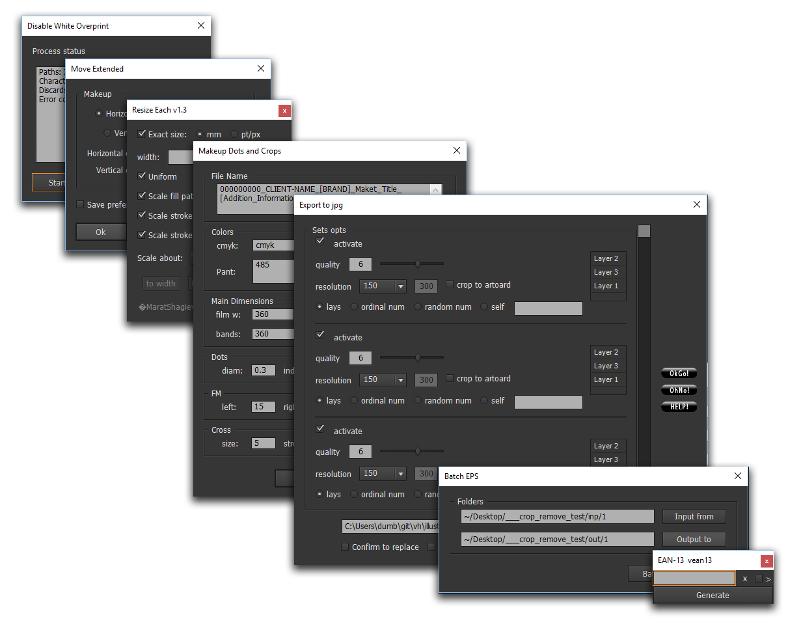

#Adobe ExtendScript for Illustrator

##Unordered set of ~40 scripts and ui-scripts

###The main purpose is: 

* automation of some aspects of preparation to flexographic printing:

  * page output
  * page layout
  * coordination of design
  * flexo prepress etc

* addition of some functions of Illustrator

